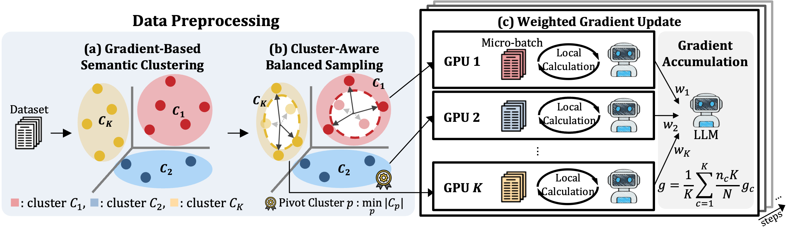

# Clustering-Based Balanced Sampling and Allocation with Data Parallelism for High-Performance Fine-Tuning
This repository contains the official implementation of "<em>Clustering-Based Balanced Sampling and Allocation with Data Parallelism for High-Performance Fine-Tuning</em>," accepted at EMNLP 2026.

<p align="center">
    <a href="https://openreview.net/forum?id=????????"></a>
    <a href="https://arxiv.org/abs/0000.00000">
    <a href="https://opensource.org/license/apache/">
</p>

<p align="center">
    🖇️&nbsp;<a href="#-overview">Overview</a>
    | 👀&nbsp;<a href="#-installation">Installation</a>
    | 📚&nbsp;<a href="#-dataset">Dataset</a>
    | 🚀&nbsp;<a href="#-training">Training</a>
    | 📝&nbsp;<a href="#-citation">Citation</a>
    | 🙏&nbsp;<a href="#-acknowledgements">Acknowledgements</a>
</p>

## 🖇️ Overview
**CluSTER** is a cluster-aware data reduction framework for efficient LLM instruction tuning that jointly coordinates data selection, data-parallel worker allocation, and gradient aggregation using target-model gradient structure, enabling substantial reductions in training data and computation while maintaining performance close to full-data fine-tuning.

<p align="center">
  
</p>

**CluSTER** consists of three main components:
1. **Gradient-based semantic clustering**: Training samples are organized according to lightweight gradient representations obtained from the target model.
2. **Cluster-aware balanced sampling and allocation**: Samples are selected to preserve intra-cluster diversity and allocated across data-parallel workers to improve inter-cluster coverage within each synchronized update.
3. **Weighted gradient aggregation**: Worker gradients are reweighted according to the original cluster distribution to account for non-uniform cluster sizes.

### Highlights
- Data-efficient fine-tuning: Reduces redundant instruction data while preserving diverse training signals.
- DP-aware allocation: Coordinates the selected data with data-parallel training instead of relying on random worker-level batching.
- Low selection overhead: Uses lightweight target-model gradient representations for efficient clustering and selection.
- Training efficiency: Achieves up to 64.6% reduction in training time while maintaining competitive downstream performance.

## 👀 Installation
We used Python 3.10.
```
# Create and activate conda environment
conda create -n cluster python=3.10
conda activate cluster
```
Install the required packages:
```
pip install -r requirements.txt
```

## 📚 Dataset
Our main experiments use [Magicoder-OSS-Instruct-75k](https://huggingface.co/datasets/ise-uiuc/Magicoder-OSS-Instruct-75K) for code instruction tuning.

The paper additionally evaluates CluSTER on:

- [Evol-Instruct-Code-80K](https://huggingface.co/datasets/nickrosh/Evol-Instruct-Code-80k-v1)
- [MedInstruct-52K](https://huggingface.co/datasets/lavita/AlpaCare-MedInstruct-52k)

Download the corresponding datasets and set `--datafile_paths` to the local path containing the training data.

## 🚀 Training
The following command reproduces the main **CluSTER** configuration on <em>Magicoder-OSS-Instruct-75K</em> with <em>CodeLlama-Python-7B</em>.

```
accelerate launch -m CluSTER.train_grad \
  --model_key codellama/CodeLlama-7b-Python-hf \
  --use_flash_attention True \
  --max_training_seq_length 1214 \
  --datafile_paths /path/to/data \
  --output_dir /path/to/output \
  --bf16 True \
  --num_train_epochs 2 \
  --per_device_train_batch_size 1 \
  --gradient_accumulation_steps 128 \
  --group_by_length False \
  --ddp_find_unused_parameters False \
  --logging_steps 1 \
  --log_level info \
  --optim adafactor \
  --max_grad_norm -1 \
  --warmup_steps 15 \
  --learning_rate 5e-5 \
  --lr_scheduler_type linear \
  --prune "close" \
  --ratio 100 \
  --badge_batch 16 \
  --badge_forward_chunk_mult 8 \
  --badge_cleanup_interval 0 \
  --dataloader_num_workers 8 \
  --tf32 True
```

### Selection Ratio
CluSTER supports different within-cluster selection ratios through the `--ratio` argument:

```
--ratio 100
--ratio 75
--ratio 50
```

These correspond to the selection settings `r = 1.00, 0.75, and 0.50` evaluated in the paper. Since CluSTER first balances cluster capacities, the final fraction of the original dataset can be smaller than the specified within-cluster ratio.

## 📝 Citation
If you find our work useful, please cite:
```

```


## 🙏 Acknowledgements

This implementation is built upon **PyTorch**, including its FullyShardedDataParallel (FSDP) modules, as well as **Hugging Face Transformers**, and **Accelerate**. We thank the authors of the publicly available models and instruction datasets used in our experiments, including **CodeLlama**, **Llama 2**, **Magicoder**, **Wizardcoder**, and **Alpacare**.

## License

This project is licensed under the Apache License 2.0. See LICENSE for details.
